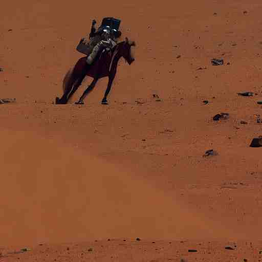
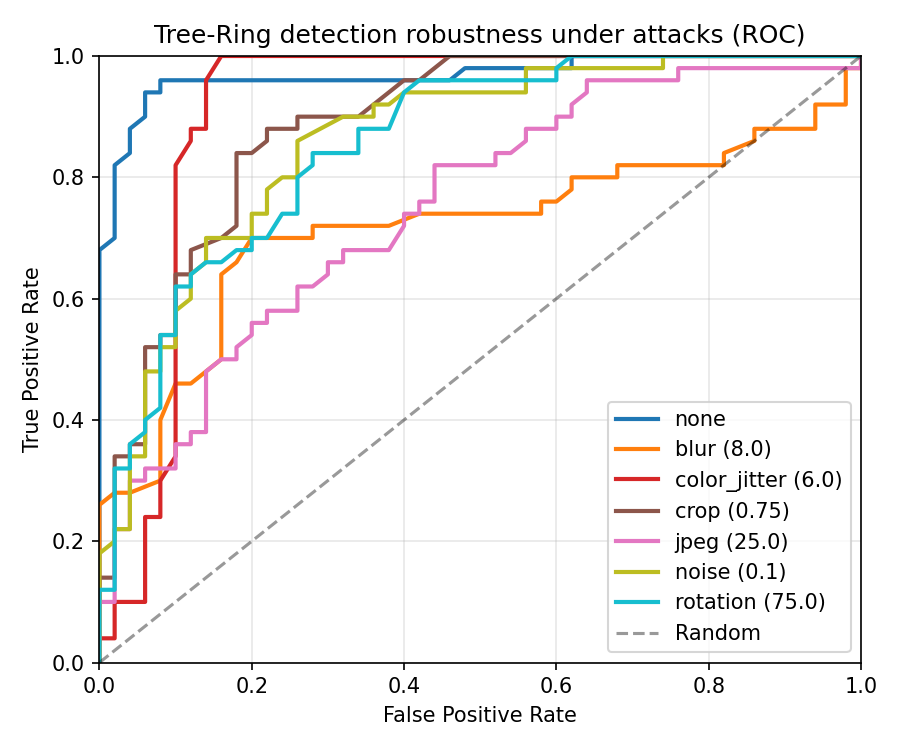
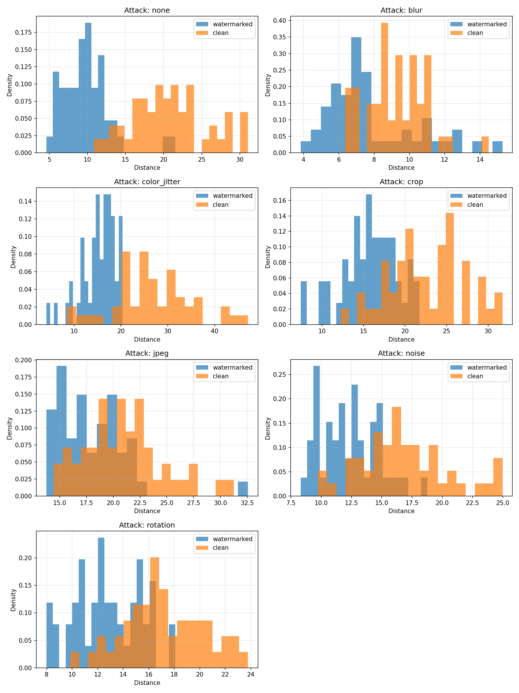

# Diffusion Model Watermarking

**Repository:** [github.com/Feiyang0303/Diffusion_watermarking](https://github.com/Feiyang0303/Diffusion_watermarking)

Implementations of two approaches from the literature:

1. **Tree-Ring Watermarks** (Wen et al., arXiv:2305.20030) – training-free, invisible fingerprints in the Fourier space of the initial noise.
2. **WatermarkDM-style pipelines** (Zhao et al., arXiv:2303.10137) – binary watermark encoder/decoder for unconditional DMs, and trigger-prompt watermarking for text-to-image DMs.

## Papers

- **2305.20030** – *Tree-Ring Watermarks: Fingerprints for Diffusion Images that are Invisible and Robust*  
  Watermark is embedded in the initial noise vector’s Fourier space (circular mask). Detection via DDIM inversion + key matching. No training; works as a plug-in for any diffusion model.

- **2303.10137** – *A Recipe for Watermarking Diffusion Models*  
  - *Unconditional/class-conditional:* Train encoder \(E_\phi\) and decoder \(D_\phi\) to embed a binary string in data; train the DM on watermarked data; decode with \(D_\phi\) from generated images.  
  - *Text-to-image:* Finetune a pretrained DM with a (trigger prompt, watermark image) pair and weight-constrained regularization \(\lambda \|\theta - \hat\theta\|_1\).

## Results (Tree-Ring + Stable Diffusion)

Curated figures and a metrics snapshot live in **[`results/`](results/)** so visitors see the evaluation without running the GPU pipeline.

**Qualitative (same prompt, SD v1.5):** clean vs. watermarked vs. watermarked after JPEG Q=25.

| Clean | Watermarked | Watermarked + JPEG (Q25) |
|-------|-------------|---------------------------|
|  |  |  |

**Robustness (n=50 samples, paper-style attacks):** ROC and distance separation (watermarked vs. clean) per attack.

| ROC (per attack) | Detection distance distributions |
|------------------|--------------------------------|
|  |  |

**Attack montage** (one sample, watermarked image under each distortion):  


**Numbers (snapshot):** see [`results/metrics_snapshot_n50.md`](results/metrics_snapshot_n50.md).

### JPEG (Q=25): detector comparison (n=50)

Same attack and sample count: **JPEG quality 25**, 50 watermarked / 50 clean, SD v1.5 Tree-Ring `rings`.

| Setting | Detector | AUC | TPR @ 1% FPR | TPR @ 5% FPR | Best acc |
|---------|----------|-----|--------------|--------------|----------|
| Baseline | First latent channel only, `key_scale=1.0` | 0.75 | 0.10 | 0.30 | 0.69 |
| Updated | Mean over channels, `key_scale=1.0` | 0.749 | 0.06 | 0.10 | 0.70 |
| Change (updated − baseline) | | −0.001 | −0.04 | −0.20 | +0.01 |

AUC is essentially flat; **best accuracy** rises slightly; **TPR at fixed low FPR** is lower for the mean-channel run on this eval. More detail: [`results/jpeg_q25_detector_comparison.md`](results/jpeg_q25_detector_comparison.md).

After new runs, regenerate CSV/plots with `run_tree_ring_sd_eval.py`, `compute_sd_eval_metrics.py`, and `plot_robustness.py`, then refresh the files in `results/` (see [`results/README.md`](results/README.md)).

## Structure

```
diffusion_watermarking/
├── results/                     # Curated figures + metrics snapshot (for README / portfolio)
├── tree_ring.py                 # Tree-Ring key construction, injection, detection (numpy/scipy)
├── watermark_dm.py              # WatermarkDM: encoder/decoder nets + text-to-image loss helpers
├── run_tree_ring_demo.py        # Demo Tree-Ring with numpy only (no SD)
├── run_tree_ring_sd.py          # Full Tree-Ring + Stable Diffusion (generate & detect)
├── run_tree_ring_sd_eval.py     # Image-level eval with attacks (none, jpeg, resize, crop)
├── run_tree_ring_eval.py        # Latent-level eval (synthetic latents, no GPU)
├── compute_sd_eval_metrics.py   # AUC, TPR@FPR, best accuracy from eval CSV
├── write_experiments_summary.py # Narrative + table template for paper experiments section
├── plot_robustness.py           # ROC and distance histograms per attack
├── plot_sd_eval_roc.py          # Single-panel ROC (image-level)
├── plot_sd_eval_dist.py         # Single-panel distance histogram
├── requirements.txt
└── README.md
```

## Quick Start

### Tree-Ring (no GPU required for demo)

```bash
cd research/code/diffusion_watermarking
pip install numpy scipy
python run_tree_ring_demo.py
```

### Tree-Ring with Stable Diffusion

```bash
pip install -r requirements.txt
python run_tree_ring_sd.py --mode both --key rings --prompt "A cat on a sofa"
# Outputs: outputs_tree_ring/watermarked.png, outputs_tree_ring/clean.png, and detection result
```

Options: `--key zeros|rand|rings`, `--radius`, `--seed`, `--steps`.

### Viewing actual results (images, metrics, paper comparison)

To get **visible outputs** (images, detection results, training curves) for analysis and comparison with the papers:

**Tree-Ring (Stable Diffusion):**  
Generates watermarked and clean images, runs detection, and saves a summary.

```bash
PYTHONPATH=.. python run_tree_ring_sd.py --mode both --key rings --prompt "A cat on a sofa" --out_dir outputs_tree_ring
```

- **outputs_tree_ring/watermarked.png** – image generated with Tree-Ring watermark  
- **outputs_tree_ring/clean.png** – same prompt, no watermark (for visual comparison)  
- **outputs_tree_ring/detection_result.txt** – distance, p_value, is_watermarked (for Table/Fig comparison)

**WatermarkDM (training + metrics + samples):**  
Trains encoder/decoder and writes metrics and sample images.

```bash
PYTHONPATH=.. python run_train_watermark_dm.py --epochs 20 --out_dir outputs_watermark_dm --save outputs_watermark_dm/checkpoints
```

- **outputs_watermark_dm/training_metrics.csv** – epoch, loss, bit_accuracy (for training curves)  
- **outputs_watermark_dm/samples_original.png**, **samples_watermarked.png** – grid of originals vs watermarked  
- **outputs_watermark_dm/training_curves.png** – loss and bit accuracy vs epoch (if matplotlib installed)  
- **outputs_watermark_dm/checkpoints/** – encoder.pt, decoder.pt

**One command for both demos:**

```bash
PYTHONPATH=.. python run_demos.py --all
```

Use `--tree_ring_prompt` and `--watermark_dm_epochs` to customize. Output directories are listed at the end.

### Experiments pipeline (Tree-Ring paper-style metrics and narrative)

After running image-level eval with attacks (see below), use these scripts to get **metrics tables** and **narrative** for the paper:

1. **Compute metrics** (AUC, TPR @ 1% / 5% FPR, best accuracy per attack; includes random baseline):

   ```bash
   PYTHONPATH=.. python compute_sd_eval_metrics.py --csv outputs_tree_ring_sd_eval/sd_eval_attacks.csv --out_dir outputs_tree_ring_sd_eval
   ```

   Produces: `sd_eval_metrics.csv`, `sd_eval_metrics_table.md`.

2. **Generate experiments summary** (setup description, results paragraph, baselines note, limitations):

   ```bash
   PYTHONPATH=.. python write_experiments_summary.py --metrics outputs_tree_ring_sd_eval/sd_eval_metrics.csv
   ```

   Produces: `EXPERIMENTS_SUMMARY.md` in the same directory. Adapt the text for your paper’s experiments section.

3. **Plots** (run before or after): `plot_robustness.py` (ROC + histograms per attack), `plot_sd_eval_roc.py`, `plot_sd_eval_dist.py` — see script docstrings.

To **add another baseline** (e.g. another method): run their detector on the same images, produce a CSV with columns `attack`, `type` (watermarked/clean), `distance`, then merge or add rows to the metrics CSV with the same column names so you can compare AUC and TPR@FPR in one table.

### Run tests

From the `diffusion_watermarking` directory. On macOS with Homebrew Python, use a virtual environment first:

```bash
cd diffusion_watermarking
python3 -m venv .venv
source .venv/bin/activate
pip install -r requirements.txt
python run_tests.py
```

(To run only Tree-Ring tests without PyTorch: `pip install numpy scipy` then `python run_tests.py`.)

**WatermarkDM recipe tests** (`tests/test_watermark_dm_recipe.py`): follow the paper recipe (Pipeline 1)—train encoder/decoder with Eq. (2), build watermarked data E(x,w), and assert decode bit accuracy. Optional full recipe with a minimal diffusion model trained on watermarked data: `RUN_WATERMARKDM_FULL_RECIPE=1 python run_tests.py`.

Or with pytest: `PYTHONPATH=.. pytest tests/ -v`

### Train WatermarkDM encoder/decoder on GPU

Requires PyTorch (and a CUDA-capable GPU for faster training). Uses synthetic data by default; replace with your dataset for real training.

```bash
pip install -r requirements.txt
cd research/diffusion_watermarking
PYTHONPATH=.. python run_train_watermark_dm.py --device cuda --epochs 20 --save checkpoints/watermark_dm
```

Options: `--device cuda|cpu`, `--epochs`, `--batch_size`, `--lr`, `--gamma`, `--bit_length`, `--image_size`, `--num_samples`, `--save DIR`.

**Train on Tiny ImageNet 200:** point `--data_dir` to the dataset root (train split: `train/<class>/images/*.JPEG`). Requires `torchvision` and `Pillow`.

```bash
PYTHONPATH=.. python run_train_watermark_dm.py \
  --data_dir /path/to/tiny-imagenet-200 \
  --image_size 64 \
  --epochs 30 \
  --batch_size 32 \
  --device cuda \
  --save checkpoints/watermark_dm_tinyimagenet
```

### WatermarkDM encoder/decoder (library)

Use `watermark_dm.py` for the binary encoder/decoder (PyTorch). Training a full DM on watermarked data requires a separate training loop (e.g. with EDM or a small diffusion model); the module provides the networks and the loss (Eq. 2). For text-to-image trigger watermarking, the loss in Eq. (5) is implemented as `text_to_image_watermark_loss` and `get_weight_penalty_l1`; actual finetuning of Stable Diffusion is left to your training setup.

## References

- Wen et al., *Tree-Ring Watermarks: Fingerprints for Diffusion Images that are Invisible and Robust*, arXiv:2305.20030.
- Zhao et al., *A Recipe for Watermarking Diffusion Models*, arXiv:2303.10137.

---

## Running on watgpu (Linux)

On Linux the repo directory name is case-sensitive. Python expects the package `diffusion_watermarking` (lowercase). After cloning you’ll have `Diffusion_watermarking`; use one of these:

**Option A – Rename the folder (simplest)**  
From your home directory:
```bash
cd ~
mv Diffusion_watermarking diffusion_watermarking
cd diffusion_watermarking
source .venv/bin/activate
python run_tests.py
```

**Option B – Symlink (keep folder name)**  
From your home directory:
```bash
cd ~
ln -s Diffusion_watermarking diffusion_watermarking
cd Diffusion_watermarking
source .venv/bin/activate
python run_tests.py
```

Then install deps and run tests as in “Run tests” above (e.g. `pip install -r requirements.txt` then `python run_tests.py`).
