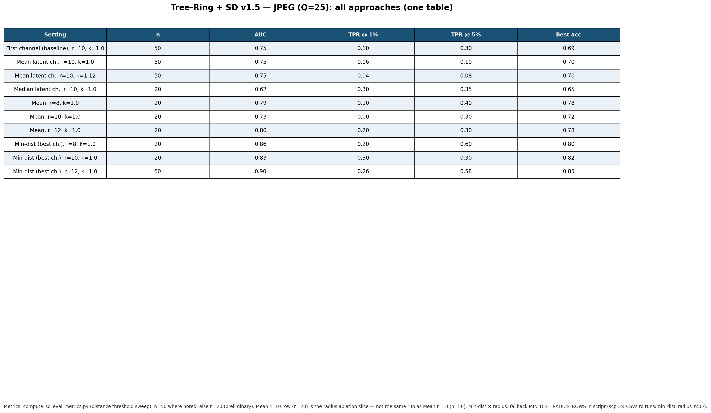
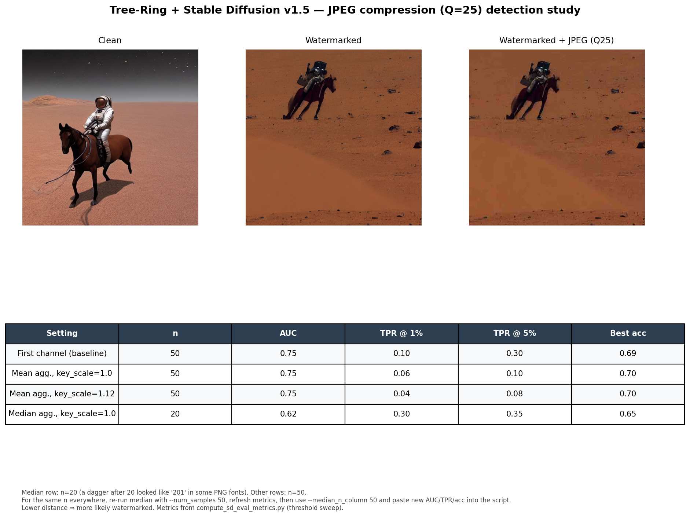
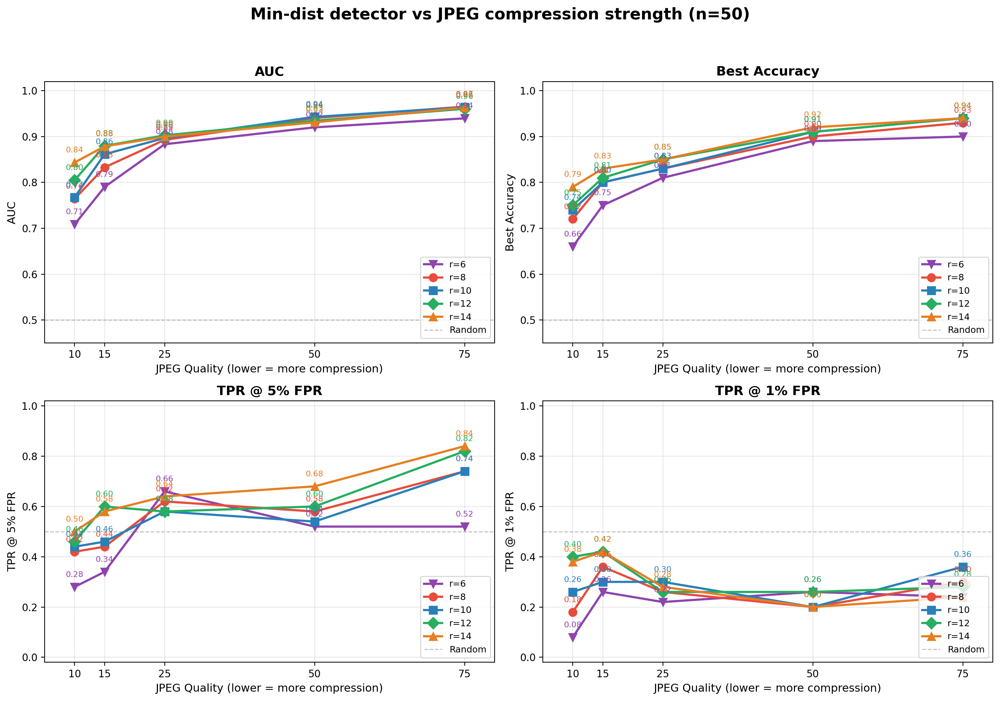

# Tree-Ring Watermarking for Diffusion-Generated Images

## Abstract

This report summarizes the paper reading and experiments I completed during the Winter 2026 term. The project is based on the Tree-Ring watermarking method proposed by Wen et al. in *Tree-Ring Watermarks: Fingerprints for Diffusion Images that are Invisible and Robust*.

The experiments compared clean and watermarked images under several attacks, including cropping, rotation, blurring, and JPEG compression. The baseline detector worked well when there was no attack, but JPEG compression at quality 25 made detection much harder. To improve JPEG robustness, I tested different detector-side approaches, including averaging across latent channels and selecting the minimum distance across channels. The results showed that mean aggregation did not improve performance, while the min-distance approach gave a relatively strong improvement under JPEG compression. Overall, the research shows that Tree-Ring watermarking can be effective, but robustness under strong compression is still an important challenge.

## 1. Introduction

Diffusion models can generate realistic images from text prompts. As these models become more common, it is important to develop methods that can identify whether an image was generated by AI. One possible solution is watermarking, where a hidden signal is embedded into the image generation process. A good watermark should be invisible to human viewers but still detectable by an algorithm after the image has been edited or compressed.

This report focuses on the Tree-Ring watermarking method. Instead of adding a visible mark to the final image, the Tree-Ring method embeds a hidden fingerprint into the initial noise used by the diffusion model. Since diffusion models generate images by gradually denoising this initial noise, the watermark can be carried through the generation process into the final image.

The main purpose of this project was to reproduce the Tree-Ring pipeline using Stable Diffusion 1.5 and evaluate how robust the watermark is under different attacks. The experiments used fifty watermarked images and fifty clean images for each attack setting. The detector performance was measured using ROC curves, AUC, true positive rate at fixed false positive rates, and best accuracy.

Figures 1 and 2 show the baseline detector results. The clean and watermarked images are clearly separated when there is no attack, but the separation becomes weaker under stronger distortions. JPEG compression at quality 25 is especially damaging because it causes more overlap between clean and watermarked detection scores.

*Figure 1.* Empirical distributions of the Tree-Ring detection distance for watermarked and clean images under different attacks.

*Figure 2.* ROC curves for detecting watermarked images under different attacks.

## 2. Background

Diffusion models generate images by starting from random noise and gradually removing noise through many denoising steps. Since the final image depends on the initial noise, the initial latent noise is used to hide a watermark.

The Tree-Ring method does not require training or fine-tuning the diffusion model. Before image generation begins, a secret key is embedded into selected Fourier coefficients of the initial noise. These coefficients are chosen using a fixed circular mask in the frequency domain. The remaining coefficients are left as normal Gaussian noise, so the generated image still appears natural.

This project used Stable Diffusion 1.5. Stable Diffusion does not generate directly in RGB pixel space. Instead, it uses a VAE latent space. For a typical 512 × 512 image, the latent representation has shape 4 × 64 × 64. The four channels are learned latent channels, not red, green, and blue image channels.

To detect the watermark, the image is first encoded back into the VAE latent space. Then, DDIM inversion is used to estimate the original initial noise. A two-dimensional Fourier transform is applied to the inverted latent, and the Fourier coefficients inside the watermark mask are compared with the secret key. If the distance between the recovered coefficients and the key is small, the image is more likely to be watermarked.

## 3. Experimental Setup

The experiments used Stable Diffusion 1.5 with the Tree-Ring watermarking method. For each attack, I tested fifty watermarked images and fifty clean images. The same detection method was applied to both groups.

The evaluated attacks included:

- no attack
- crop with ratio 0.75
- rotation by 75 degrees
- JPEG compression at quality 25
- blur with strength 8

The main evaluation metrics were:

| Metric | Meaning |
|---|---|
| AUC | Measures overall separation between clean and watermarked images |
| TPR @ 1% FPR | True positive rate when false positive rate is fixed at 1% |
| TPR @ 5% FPR | True positive rate when false positive rate is fixed at 5% |
| Best Accuracy | Best classification accuracy after choosing an optimal threshold |

JPEG compression at quality 25 was the most important attack to study further because it caused the baseline detector to perform much worse.

## 4. Detector Approaches for JPEG Robustness

The baseline JPEG detector used only the first latent channel after DDIM inversion. It also used a fixed Fourier mask radius and key scale 1.0. In the later experiments, the embedding process and model weights stayed the same. Only the detection method was changed.

This made the comparison more controlled because any performance change came from the detector rather than from retraining or changing the image generation process.

### 4.1 Mean Aggregation Across Channels

The first approach was to average the four VAE latent channels at each spatial location. After averaging, one two-dimensional Fourier transform was applied, and the same Tree-Ring distance was computed.

The reason for trying this method was that averaging might reduce noise from imperfect DDIM inversion. If JPEG compression affects different channels in slightly different ways, averaging could potentially keep the shared watermark signal while reducing random channel noise.

However, the results did not show a clear improvement. On the JPEG Q25 test with a sample size of 50, the AUC stayed close to the baseline. The baseline AUC was about 0.749, while mean aggregation gave about 0.75. Best accuracy only increased slightly from about 0.69 to about 0.70.

More importantly, the performance at strict false positive rates became worse. TPR at 1% FPR decreased from about 0.10 to about 0.06, and TPR at 5% FPR decreased from about 0.30 to about 0.10. This means that mean aggregation is not a good fix for JPEG compression, especially when the detector needs to avoid false positives.

### 4.2 Min-Distance Across Channels

The second approach was to compute the Tree-Ring distance separately for each of the four latent channels. Then, instead of averaging the channels, the detector selected the smallest distance as the final image-level score.

The idea behind this method is that JPEG compression and inversion errors may not affect all latent channels equally. One channel may still preserve the watermark more clearly than the others. By choosing the channel with the smallest distance to the key, the detector may recover a stronger watermark signal.

This method performed much better in the JPEG experiments. With a larger mask radius, such as `r = 12`, the min-distance detector achieved about 0.90 AUC, 0.26 TPR at 1% FPR, 0.58 TPR at 5% FPR, and 0.85 best accuracy.

This is a large improvement compared with the JPEG baseline, which had about 0.75 AUC and 0.69 best accuracy. However, this method also needs careful interpretation. Since it chooses the best result out of four channels, the false positive rate and p-values may need extra calibration. Future work should test this method on a larger clean validation set.

### 4.3 Additional Ablations

I also tested other changes, including different Fourier mask radii, larger key scales in some runs, and a sweep over different JPEG quality values. These experiments show that JPEG Q25 is only one point on a larger compression robustness curve.

Figure 3 summarizes the JPEG-focused detector settings and mask radius combinations.

*Figure 3.* JPEG robustness comparison across detector settings and Fourier mask radii.

## 5. Results

### 5.1 Multi-Attack Robustness

Figure 4 shows one watermarked sample after each distortion. This gives a visual check of how the attacks change the image.

*Figure 4.* Montage of one watermarked sample under different attacks.

Table 1 shows the main quantitative results.

| Attack | AUC | TPR @ 1% FPR | TPR @ 5% FPR | Best Accuracy |
|---|---:|---:|---:|---:|
| none | 0.97 | 0.70 | 0.88 | 0.94 |
| crop (0.75) | 0.89 | 0.14 | 0.36 | 0.83 |
| rotation (75°) | 0.85 | 0.12 | 0.36 | 0.78 |
| JPEG (Q25) | 0.75 | 0.10 | 0.30 | 0.69 |
| blur (8) | 0.72 | 0.28 | 0.28 | 0.75 |
| ... | see full snapshot | see full snapshot | see full snapshot | see full snapshot |

*Table 1.* Snapshot metrics from `results/metrics_snapshot_n50.md`.

The no-attack case had the best performance, with an AUC of 0.97 and best accuracy of 0.94. This means the watermark was highly detectable when the image was not modified.

Cropping and rotation reduced performance but still kept moderate separability between clean and watermarked images. JPEG Q25 caused a larger drop, with AUC decreasing to 0.75 and best accuracy decreasing to 0.69. Blur also reduced performance, with an AUC of 0.72.

Figure 5 compares a clean image, a watermarked image, and a watermarked image after JPEG Q25 compression. The watermark is not visually obvious, but JPEG compression makes the detector less reliable.

  

*Figure 5.* Clean image, Tree-Ring watermarked image, and watermarked image after JPEG Q25 compression.

### 5.2 JPEG Compression Results

The JPEG Q25 baseline used only the first latent channel, with mask radius `r = 10`, key scale 1.0, and `n = 50`. The baseline achieved about 0.75 AUC, 0.10 TPR at 1% FPR, 0.30 TPR at 5% FPR, and 0.69 best accuracy.

Mean aggregation across channels did not meaningfully improve the result. Although the best accuracy increased slightly to about 0.70, the true positive rate at strict false positive rates became worse. This suggests that averaging the four channels may weaken the strongest watermark signal instead of improving it.

The min-distance detector gave the best JPEG performance. With a larger mask radius such as `r = 12`, it reached about 0.90 AUC and 0.85 best accuracy. This suggests that at least one latent channel may keep the watermark signal more strongly after JPEG compression.

*Figure 6.* Curated one-page summary of the JPEG robustness experiments.

*Figure 7.* JPEG quality sweep showing how detection performance changes as compression becomes stronger.

## 6. Conclusion

This project reproduced and evaluated the Tree-Ring watermarking method for diffusion-generated images using Stable Diffusion 1.5. The baseline detector worked well when there was no attack and remained somewhat robust under cropping and rotation. However, JPEG compression significantly reduced detection performance.

To improve JPEG robustness, I tested mean aggregation and min-distance detection across latent channels. Mean aggregation did not improve the result and hurt performance at strict false positive rates. The min-distance detector across channels gave a much stronger improvement, especially when combined with a larger Fourier mask radius.

Overall, the experiments suggest that Tree-Ring watermarking is a promising method for detecting diffusion-generated images, but JPEG robustness remains a key challenge. Future work should use larger evaluation sets, calibrate multi-channel detectors carefully, and explore watermark designs that are more robust to compression.

## Reference

Wen, Y., Kirchenbauer, J., Geiping, J., & Goldstein, T. *Tree-Ring Watermarks: Fingerprints for Diffusion Images that are Invisible and Robust*. arXiv:2305.20030.
